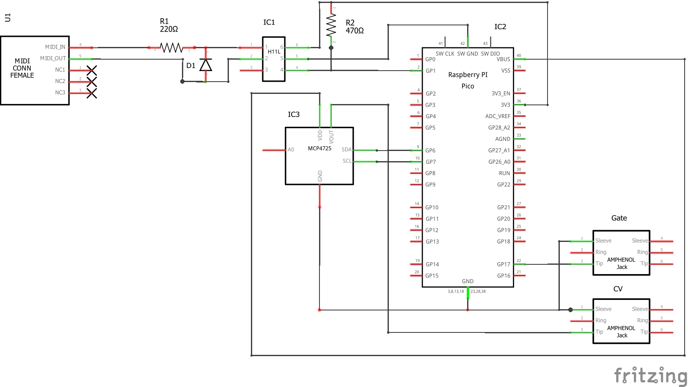

# Raspberry Pi Pico as MIDI to CV converter

I’ve been toying with the idea of building a MIDI to CV converter for at least a decade. Now I’ve finally had a go using MicroPython on the Raspberry Pi Pico.

Here’s how I managed to control my Moog Werkstatt-01 over MIDI using the Pico, a handful of components and a MCP4725 12-bit DAC:

https://youtu.be/aGfQHL1jU4I

## The Hardware
### BOM
- Raspberry Pi Pico
- HC11L optocoupler
- 220Ω Resistor
- 470Ω Resistor
- small signal diode (eg 1N914)
- MCP4725 module

### Circuit Diagram

## The Code
The code is written in Micropython. Its only external dependency is the [SimpleMIDIDecoder](https://diyelectromusic.wordpress.com/2021/06/13/raspberry-pi-pico-midi-channel-router/) class by [@diyelectromusic](https://twitter.com/diyelectromusic). You can download the latest version on GitHub here: [SimpleMIDIDecoder.py](https://github.com/diyelectromusic/sdemp/blob/master/src/SDEMP/Micropython/SimpleMIDIDecoder.py).
